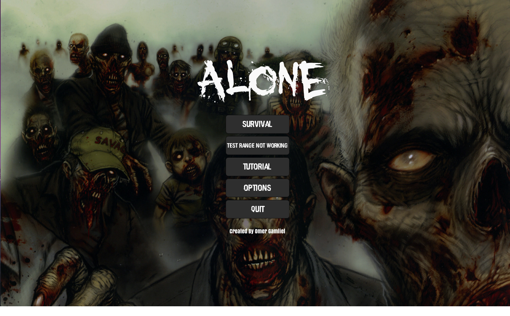
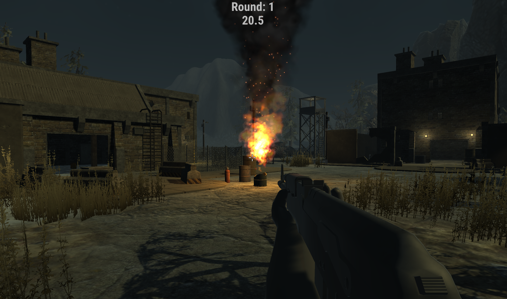
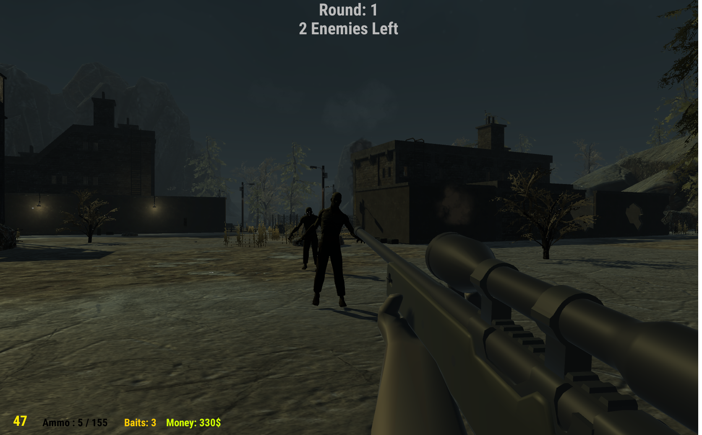
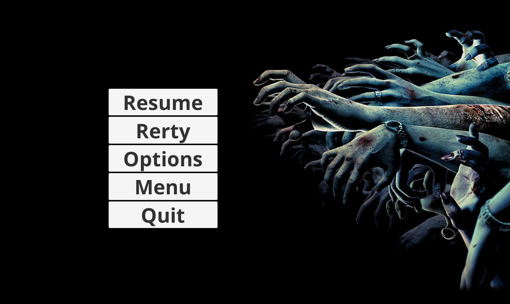
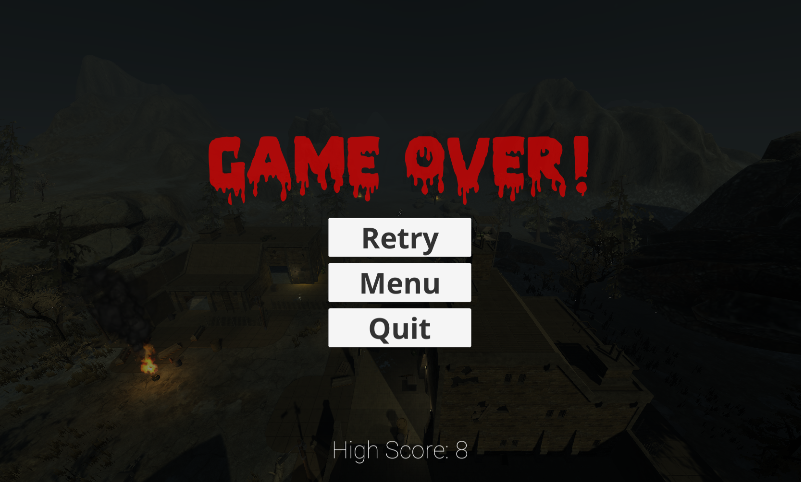

# Alone

A 3d FPS game project, built with Unity.

"Alone" has been developed as a part of final graduation project at the "Weizmann institute of science" in 12th grade.

## Screenshots

## Technologies

 - **Unity 3d**

## Download the game

- [Alone](https://drive.google.com/drive/folders/0B-u6v7WwhosebEhKSU5MU201dU0?usp=sharing)

# Author 🙋

-   **Omer Gamliel** - [LinkedIn](https://www.linkedin.com/in/omer-gamliel-6a813a188/)

